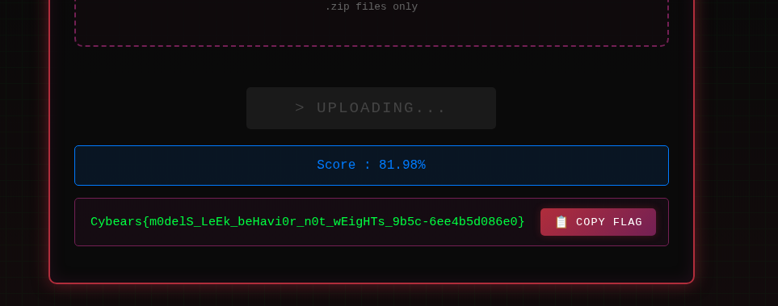

# Part 01: Data Collection and Preprocessing

The first part of solving this challenge requires us to find a dataset similar to the one used to train the original model. We know that the original model was trained on abstracts of **computer sicence scientific articles** so that our target datasets.

[Arxiv](https://www.kaggle.com/datasets/Cornell-University/arxiv) is a large repository of scientific articles that contains hunderand of thousands of research papers articles from various fields including **computer science** so it's a perfect start.

---

## Import Dependencies

```python
import os
import json
import pandas as pd
from tqdm import tqdm
from typing import Generator, Dict
from collections import defaultdict
```

---

## Custom JSON Loader

```python
class JSONlLoader:

    def __init__(self, filename: str) -> None:
        self.filename = filename

    def __iter__(self) -> Generator[Dict, None, None]:
        total_bytes = os.path.getsize(self.filename)

        with tqdm(total=total_bytes) as pbar:
            with open(self.filename, "r") as f:
                for line in f:
                    bytes_read = len(line)
                    try:
                        pbar.update(bytes_read)
                        yield json.loads(line.strip('\n'))
                    except Exception as e:
                        print(f"Unexpected error occurred: {e}")
```

---

## Load ArXiv Dataset
```python
PATH = "/kaggle/input/arxiv/arxiv-metadata-oai-snapshot.json"
records = list(IJSONLoader(PATH))
df = pd.DataFrame(records)
```

---

## Filter by Year
```python
df['year'] = df['update_date'].progress_apply(lambda x: int(x.split('-')[0]))
df = df[df['year'] >= 2012]
```

---

## Extract Category Statistics
```python
unique_categories = defaultdict(int)

for record in tqdm(records):
    for cat in record['categories'].split():
        unique_categories[cat] += 1
```

---

## Filter Computer Science Categories
```python
cs_categories = {
    cat: count 
    for cat, count in unique_categories.items() 
    if cat.startswith('cs.')
}
```

---

## Filter DataFrame to CS Papers

```python
mask = df['categories'].progress_apply(
    lambda x: any([(cat in cs_categories.keys()) for cat in x.split(' ')])
)
df = df[mask]
```

---

## Sample Training Data
```python
subset = df.sample(8000)
subset.to_csv("subset.csv", index=False)
```

**Strategy**:
- Randomly samples **8,000 papers** from the filtered CS dataset.
- Saves to CSV for later use in querying the black-box API.
- This subset will be used to collect training labels via the `/predict` endpoint.

**Why 8,000?**
- With batch size limit of 64, this requires ~125 API requests.
- Balances between getting enough training data and API query constraints.
- Provides diverse examples across CS venues for model training.

---

# Part 02: Data Labeling via Black-Box API Queries

This section demonstrates how to exploit the threshold query parameter to extract probability ranges instead of hard labels to provide better learning signal for our model during training. 

This can be achieved by querying the API multiple times on the same datapoints by varying the threshold starting from the smaller threshold. For example if the label `info.info-ia` appears in the 57th datapoint's list of venues with `threshold=0.7` but doesn't appear in the same datapoint when changing the threshold to 0.8 then we can conclude that the probability of that class lies in the interval `[0.7, 0.8]`.

---

## Import Dependencies
```python
import httpx
import time
import json
import pandas as pd
import numpy as np
from returns.result import safe
from nltk import word_tokenize
from tqdm import tqdm
from collections import defaultdict
```

---

## Configuration Constants
```python
BASE_URL = f"${API_URL}/predict"
MIN_TOKENS, MAX_TOKENS = 16, 300
BATCH_SIZE = 64
```

---

## Robust API Request Function
```python
@safe(exceptions=(httpx.TransportError, httpx.HTTPStatusError))
def make_request(
    url: str,
    documents: list[str],
    min_threshold: float = 0.3,
    k: int = 10,
    max_tries: int = 3
) -> httpx.Response:
    
    params = {
        'threshold': min_threshold,
        'k': k
    }

    documents = [
        {"description": doc}
        for doc in documents
    ]

    body = {
        "documents": documents
    }

    response = None

    for attempt in range(max_tries):
        try:
            response = httpx.post(url=url, params=params, json=body)

            if response.status_code in [
                httpx.codes.TOO_MANY_REQUESTS,
                httpx.codes.INTERNAL_SERVER_ERROR,
                httpx.codes.BAD_GATEWAY,
                httpx.codes.SERVICE_UNAVAILABLE,
                httpx.codes.GATEWAY_TIMEOUT
            ]:
                time.sleep(2 ** (attempt * 0.8))   
            else:
                break
            
        except httpx.TransportError as e:
            if attempt == (max_tries - 1):
                raise e
            
            time.sleep(2 ** (attempt * 0.8)) 

    return response.raise_for_status()
```

---

## Test the API Connection
```python
result = make_request(
    url=BASE_URL,
    documents=["Ontologies have been known for their powerful semantic representation..."],
    min_threshold=0.0,
    k=10
)

result.unwrap().json()
```

**Output example**:
```json
[[
  {"name": "info.info-ai", "rank": 0},
  {"name": "info.info-wb", "rank": 1},
  {"name": "info.info-ir", "rank": 2}
]]
```

---

## Load and Filter Dataset
```python
data = pd.read_csv('subset.csv')

# Tokenize and count tokens
data['num_tokens'] = data['abstract'].apply(word_tokenize).apply(len)

# Filter by token constraints
data = data[(data['num_tokens'] >= MIN_TOKENS) & (data['num_tokens'] <= MAX_TOKENS)]
data['abstract'] = data['abstract'].apply(lambda x: x.strip())
```

- This ensures compliance with API requirements.

---

## Threshold-Varying Annotation Strategy
```python
def annotate(
    data: pd.DataFrame, 
    th_step: float = 0.2, 
    minimum: float = 0.0,
    maximum: float = 1.0
) -> dict[int, dict]:

    documents = []
    indices = []
    l = {}
    
    for i, threshold in enumerate(np.arange(minimum, maximum, th_step)):

        for j, (idx, row) in tqdm(enumerate(data.iterrows()), total=len(data)):

            documents.append(row['abstract'])
            indices.append(idx)
                
            if (len(documents) == BATCH_SIZE) or (j == len(data) - 1):
            
                results = make_request(
                    url=BASE_URL,
                    documents=documents,
                    min_threshold=threshold,
                    k=10
                )

                try:
                    results = results.unwrap().json()

                except Exception as e:
                    print(e)
                    continue

                for idx, venues, doc in zip(indices, results, documents):
                        
                    if idx not in l:
                        l[idx] = {
                            "id": idx,
                            "abstract": doc,
                            "venues": {
                                venue['name']: {
                                    "rank": venue['rank'], 
                                    "min_th": threshold
                                }
                                for venue in venues
                            }
                        }
                    else:
                        for venue in venues:
                            l[idx]['venues'][venue['name']]['min_th'] = threshold

                documents.clear()
                indices.clear()

    return l
```

- **Multiple Threshold Passes**: Queries each document at different thresholds (0.0, 0.1, 0.2, ..., 0.9)
- **Probability Range Inference**: If a venue appears at threshold 0.7 but not 0.8, it is in the range [0.7, 0.8).

**Data structure**:
```json
{
  "123": {
    "id": 123,
    "abstract": "...",
    "venues": {
      "cs.AI": {"rank": 0, "min_th": 0.9},
      "cs.LG": {"rank": 1, "min_th": 0.7}
    }
  }
}
```

---

## Execute Annotation with Fine-Grained Thresholds
```python
annotated_data = annotate(data, th_step=0.1)
```

- `th_step=0.1`: Query at thresholds [0.0, 0.1, 0.2, ..., 0.9]
- 10 passes × 7,656 documents = **76,560 total API calls**
- With batching: ~1,197 actual requests (76,560 / 64)
---

## Save Annotated Data
```python
with open("annotated_data.json", "w") as f:
    json.dump(annotated_data, f, indent=4)
```

---

# Part 03: Model Training and Evaluation

This section explains the training process of the substitute model that is supposed to mimic the hosted model's behavior. the training/fine-tuninh process 
is generic for any deep learning model with the exception being the custom **probability range loss function** added alongside the cross entropy loss : 

```python
loss = F.binary_cross_entropy(y_hat, (y >= 0.5).float()) + F.binary_cross_entropy(y_hat[row, col], y[row, col] + 0.05)
```

The first term is the generic BCE loss used to train model to predict the right class based on hard labels (1 if probability equals or above 0.5, 0 otherwise). The second term being the **probability range loss** which is the BCE loss again but based on the probability range center instead of the hard label this will make sure that the probability distribution of our model is similar to that of the deplyed model which is what the similarity metric `Soft Jaccard Index` is all about.

---

## Import Dependencies
```python
import numpy as np
import pandas as pd
import os
import json
import torch
import seaborn as sns
import random
import requests
from tqdm.auto import tqdm
from torch import nn, optim, Tensor
from torch.nn import functional as F
from torch.utils.data import DataLoader, TensorDataset
from sentence_transformers import SentenceTransformer
from dataclasses import dataclass, asdict
from torch_sparse import SparseTensor
from typing import Tuple, Callable, Dict
from sklearn.model_selection import train_test_split
from sklearn.metrics import accuracy_score, f1_score
from collections import defaultdict
```

**Key libraries**:
- `torch`: Deep learning framework.
- `sentence_transformers`: Pre-trained embeddings (same as black-box model).
- `torch_sparse`: Efficient sparse tensor operations for label matrix.
- `sklearn`: Train/test splitting and evaluation metrics.

---

## Reproducibility Setup
```python
SEED = 42

def seed_everything(seed: int) -> None:    
    random.seed(seed)
    os.environ['PYTHONHASHSEED'] = str(seed)
    np.random.seed(seed)
    torch.manual_seed(seed)
    torch.cuda.manual_seed(seed)
    torch.backends.cudnn.deterministic = True
    torch.backends.cudnn.benchmark = True

seed_everything(SEED)
```

**Purpose**: Ensures reproducible results across runs by fixing all random seeds.

---

## Load Annotated Data
```python
records = None

with open('./annotated_data.json', 'r') as f:
    records = list(json.load(f).values())

print(len(records))  # Output: 7656
```

---

## Filter High-Confidence Labels
```python

### Remove the datapoints where all the classes have probability less 0.5
records = [
    record
    for record in records
    if any(map(lambda x: x['min_th'] >= 0.5, record['venues'].values()))
]
```

---

## Load Venue Labels

We load the venues that represent our classes from the API to make sure that the class2index mapping of our model
is the same as the hosted model.

```python
venues = None

res = requests.get(f"{API_URL}/labels")

if res.status == 200:
    venues = res.json()

print(len(venues))  # Output: 55
```

---

## Create Article-Venue Sparse Matrix
```python
article_keyword = []
min_proba = []

for i, record in enumerate(records):
    for keyword, kw_info in record['venues'].items():
        article_keyword.append([i, venues.index(keyword)])
        min_proba.append(kw_info['min_th'])

print(len(venues), len(min_proba), len(article_keyword))
```

---

## Construct Dense Label Matrix

```python
row, col = torch.tensor(article_keyword).t()
min_proba = torch.tensor(min_proba)
labels = SparseTensor(row=row, col=col, value=min_proba).to_dense()
```

---

## Extract Article Embeddings

Extract the article embeddings using the same base model as the deplyed model.

```python

model_name = "all-MiniLM-L6-v2"
sent_trans = SentenceTransformer(model_name)

articles_embeddings = torch.from_numpy(
    sent_trans.encode(
        sentences=[record['abstract'] for record in records],
        batch_size=64,
        show_progress_bar=True,
        device='cuda',
        normalize_embeddings=True,
    )
)
```

---

## Train/Test Split

```python
x_train, x_test, y_train, y_test = train_test_split(
    articles_embeddings, 
    labels, 
    test_size=0.1
)
```

**Split**: 90% train (6,890 samples) / 10% test (766 samples)

---

## Multi-Layer Perceptron (MLP) Model

A simple MLP with flexible number of layers and activation function.

```python
class MLP(nn.Module):

    def __init__(self, 
        in_dim: int,
        hidden_dims: list[int],
        out_dim: int,
        hidden_act: Callable[[Tensor], Tensor] = F.relu,
        out_act: Callable[[Tensor], Tensor] = nn.Identity(),
        norm: bool = False
    ) -> None:
        super().__init__()

        self.in_dim = in_dim
        self.hidden_dims = hidden_dims
        self.out_dim = out_dim
        self.hidden_act = hidden_act
        self.out_act = out_act

        self.layers = nn.ModuleList()

        self.layers.append(nn.Sequential(
            nn.Linear(in_dim, hidden_dims[0]),
            nn.BatchNorm1d(hidden_dims[0]) if norm else nn.Identity()
        ))

        for input_dim, output_dim in zip(hidden_dims[:-1], hidden_dims[1:]):
            self.layers.append(nn.Sequential(
                nn.Linear(input_dim, output_dim),
                nn.BatchNorm1d(output_dim) if norm else nn.Identity()
            ))
            
        self.out = nn.Linear(hidden_dims[-1], out_dim)

    def forward(self, x: Tensor) -> Tensor:
        for layer in self.layers:
            x = self.hidden_act(layer(x))

        x = self.out(x)
        x = self.out_act(x)

        return x
```

---

## Training Configuration
```python
@dataclass
class Config:
    ### Model Config
    in_dim: int
    hidden_dims: list[int]
    out_dim: int
    hidden_act: Callable[[Tensor], Tensor] = F.relu
    out_act: Callable[[Tensor], Tensor] = F.sigmoid
    norm: bool = False

    ### Training Hyperparameters
    batch_size: int = 64
    lr: float = 1e-3
    weight_decay: float = 0.0
    num_epochs: int = 20
    num_negatives: int = 3

    ### Data Loading
    num_workers: int = 4
    prefetch_factor: int = 2

    ### Device
    device: str = 'cuda' if torch.cuda.is_available() else 'cpu'

    ### Logging 
    log_every: int = 1
```

---

## Training Iteration Function

Standard training iteration for any MLP the only difference being the additional probability range loss.

```python
def train_iteration(
    model: MLP,
    optimizer: optim.Optimizer,
    batch: Tuple[Tensor, Tensor],
    phase: str,
    device: str
) -> Dict[str, float]:
    
    is_training = phase == 'train'
    model.train(is_training)

    with torch.set_grad_enabled(is_training):
        
        ### Move Data To The Right Device
        x, y = batch
        x, y = x.to(device), y.to(device)

        ### Forward pass
        y_hat = model.forward(x)

        ### Loss: Binary cross-entropy with threshold at 0.5 (hard labels)
        ### Additional Loss: Binary cross-entropy to predict the probability center 
        ### For example : in the range [0.7,0.8) => predict 0.75
        row, col = torch.argwhere(y != 0).t()
        loss = F.binary_cross_entropy(y_hat, (y >= 0.5).float()) + F.binary_cross_entropy(y_hat[row, col], y[row, col] + 0.05)

    ### Backward pass
    if is_training:
        optimizer.zero_grad()
        loss.backward()
        optimizer.step()

    ### Metrics
    y_hat = y_hat.detach().cpu().numpy().reshape(-1)
    y_hard = np.int32(y_hat >= 0.5).reshape(-1)
    y = (y >= 0.5).detach().cpu().numpy().reshape(-1)

    acc = accuracy_score(y_true=y, y_pred=y_hard)
    f1 = f1_score(y_true=y, y_pred=y_hard, average="macro", zero_division=0.0)

    return {
        "Loss": loss.item(),
        "Accuracy": acc,
        "Macro-F1 Score": f1,
    }
```

---

## Main Training Loop

Standard training loop.

```python
def train(
    train_dataset: Tuple[Tensor, Tensor],
    test_dataset: Tuple[Tensor, Tensor],
    config: Config
) -> Tuple[MLP, pd.DataFrame]:

    ### Create The Model & Optimizer
    model = MLP(
        in_dim=config.in_dim,
        hidden_dims=config.hidden_dims,
        out_dim=config.out_dim,
        hidden_act=config.hidden_act,
        out_act=config.out_act,
        norm=config.norm
    ).to(config.device)

    optimizer = optim.AdamW(
        params=model.parameters(), 
        lr=config.lr, 
        weight_decay=config.weight_decay
    )

    ### Create Loaders
    train_loader = DataLoader(
        dataset=TensorDataset(*train_dataset), 
        batch_size=config.batch_size,
        shuffle=True,
        drop_last=True,
    )

    test_loader = DataLoader(
        dataset=TensorDataset(*test_dataset), 
        batch_size=config.batch_size, 
        shuffle=False,
        drop_last=False,
    )

    ### Initialize History
    history = []

    ### Training Loop
    for epoch in range(config.num_epochs):

        for phase in ['train', 'test']:

            loader = train_loader if phase == 'train' else test_loader
            running_values = defaultdict(float)
            
            for i, batch in tqdm(enumerate(loader), total=len(loader)):

                results = train_iteration(model, optimizer, batch, phase, config.device)   

                for metric_name, metric_value in results.items():
                    running_values[metric_name] += metric_value / len(loader)

                results['Epoch'] = epoch 
                results['Iteration'] = i
                results['Phase'] = phase

                history.append(results)

            if (epoch + 1) % config.log_every == 0:
                msg = f"Epoch : {(epoch+1)}/{config.num_epochs} | Phase : {phase.upper()} | "
                msg += " | ".join([f"{key}={value}" for key, value in running_values.items()])
                print(msg)

    return model, pd.DataFrame(history)
```
---

## Instantiate Configuration
```python
config = Config(
    in_dim=x_train.size(-1),  # 384
    hidden_dims=[x_train.size(-1) // 2] * 2,  # [192, 192]
    out_dim=y_train.size(-1),  # 55
    hidden_act=F.selu,  # Self-normalizing activation
    out_act=F.sigmoid,  # Output probabilities [0, 1]
    norm=True,  # Enable batch normalization
    batch_size=64,
    lr=1e-4,  # Conservative learning rate
    weight_decay=1e-3,  # L2 regularization
    num_epochs=30,
    log_every=2,
    device='cpu'
)
```

---

## Train the Model
```python
model, history = train(
    (x_train, y_train),
    (x_test, y_test),
    config=config
)
```

**Training progress** (selected epochs):
```
Epoch : 2/30  | Phase : TRAIN | Loss=0.587 | Accuracy=0.694 | Macro-F1=0.607
Epoch : 2/30  | Phase : TEST  | Loss=0.566 | Accuracy=0.730 | Macro-F1=0.639

Epoch : 10/30 | Phase : TRAIN | Loss=0.159 | Accuracy=0.960 | Macro-F1=0.900
Epoch : 10/30 | Phase : TEST  | Loss=0.152 | Accuracy=0.961 | Macro-F1=0.902

Epoch : 30/30 | Phase : TRAIN | Loss=0.063 | Accuracy=0.980 | Macro-F1=0.952
Epoch : 30/30 | Phase : TEST  | Loss=0.072 | Accuracy=0.975 | Macro-F1=0.939
```

---

## Save Model Checkpoint
```python
conf = asdict(config)
conf['hidden_act'] = conf['hidden_act'].__name__
conf['out_act'] = conf['out_act'].__name__

checkpoint = {
    "config": conf,
    "state_dict": model.state_dict(),
}

torch.save(checkpoint, 'mlp_head_chkp.pt')
```

**Checkpoint includes**:
- Model architecture configuration.
- Trained weights.
- Ready for submission inference code (see inference.py).

## Submission Results

Submitting this will get you a score of 81% revealing the flag !, for reference without the probability range loss you only get to 66% similarity.




---